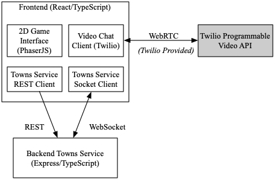

<h1>
# spring-23-team-201
</h1>
<h2>
About our project
</h2>

Our project idea, inspired by the collaborative project r/place on Reddit, is to implement a new type of interactable area that allows users to work together to incrementally contribute to a large digital canvas. The driving idea behind r/place is that “Individually, you can create something, but together, you can create something more,” and our own feature is driven by this core idea. We consider this a way to introduce a more permanent marker of progress in an application that focuses primarily on temporarily interactable areas. Using a grid system where a tile represents one “pixel”, a player can choose to change the color of one square at a time using a color picker. Players can paint over any pixel but are restricted to painting only one per allotted amount of time, to help keep contributions more balanced. This type of interaction introduces a more asynchronous activity that allows users to gradually contribute to a town over time, encouraging them to return to a town to continue their masterpiece and see what others have added to it. Additionally, users can interact through the comments section, and download the artwork as a jpg or mp4 to share with friends. After a certain amount of time has passed, the canvas is wiped to allow a new creation to be made, making space for new forms of expression. Past canvases are stored on an art wall for users to view and rewatch the creation process.

# Covey.Town

Covey.Town provides a virtual meeting space where different groups of people can have simultaneous video calls, allowing participants to drift between different conversations, just like in real life.
Covey.Town was built for Northeastern's [Spring 2021 software engineering course](https://neu-se.github.io/CS4530-CS5500-Spring-2021/), and is designed to be reused across semesters.
You can view our reference deployment of the app at [app.covey.town](https://app.covey.town/), and our project showcase ([Spring 2022](https://neu-se.github.io/CS4530-Spring-2022/assignments/project-showcase), [Spring 2021](https://neu-se.github.io/CS4530-CS5500-Spring-2021/project-showcase)) highlight select student projects.

The figure above depicts the high-level architecture of Covey.Town.
The frontend client (in the `frontend` directory of this repository) uses the [PhaserJS Game Library](https://phaser.io) to create a 2D game interface, using tilemaps and sprites.
The frontend implements video chat using the [Twilio Programmable Video](https://www.twilio.com/docs/video) API, and that aspect of the interface relies heavily on [Twilio's React Starter App](https://github.com/twilio/twilio-video-app-react). Twilio's React Starter App is packaged and reused under the Apache License, 2.0.

A backend service (in the `townService` directory) implements the application logic: tracking which "towns" are available to be joined, and the state of each of those towns.

## Running this app locally

Running the application locally entails running both the backend service and a frontend.

### Setting up the backend

To run the backend, you will need a Twilio account. Twilio provides new accounts with $15 of credit, which is more than enough to get started.
To create an account and configure your local environment:

1. Go to [Twilio](https://www.twilio.com/) and create an account. You do not need to provide a credit card to create a trial account.
2. Create an API key and secret (select "API Keys" on the left under "Settings")
3. Create a `.env` file in the `townService` directory, setting the values as follows:

| Config Value            | Description                               |
| ----------------------- | ----------------------------------------- |
| `TWILIO_ACCOUNT_SID`    | Visible on your twilio account dashboard. |
| `TWILIO_API_KEY_SID`    | The SID of the new API key you created.   |
| `TWILIO_API_KEY_SECRET` | The secret for the API key you created.   |
| `TWILIO_API_AUTH_TOKEN` | Visible on your twilio account dashboard. |

### Starting the backend

Once your backend is configured, you can start it by running `npm start` in the `townService` directory (the first time you run it, you will also need to run `npm install`).
The backend will automatically restart if you change any of the files in the `townService/src` directory.

### Configuring the frontend

Create a `.env` file in the `frontend` directory, with the line: `REACT_APP_TOWNS_SERVICE_URL=http://localhost:8081` (if you deploy the towns service to another location, put that location here instead)

### Running the frontend

In the `frontend` directory, run `npm start` (again, you'll need to run `npm install` the very first time). After several moments (or minutes, depending on the speed of your machine), a browser will open with the frontend running locally.
The frontend will automatically re-compile and reload in your browser if you change any files in the `frontend/src` directory.
>>>>>>> fa315f9 (solution to IP2 -- starter code)
